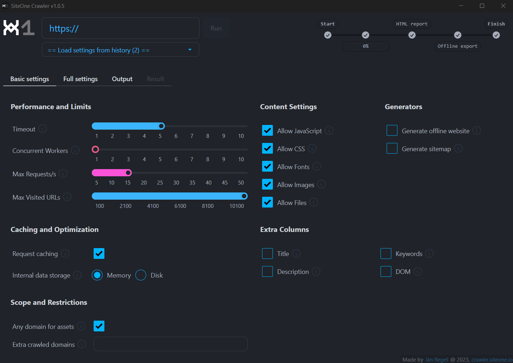
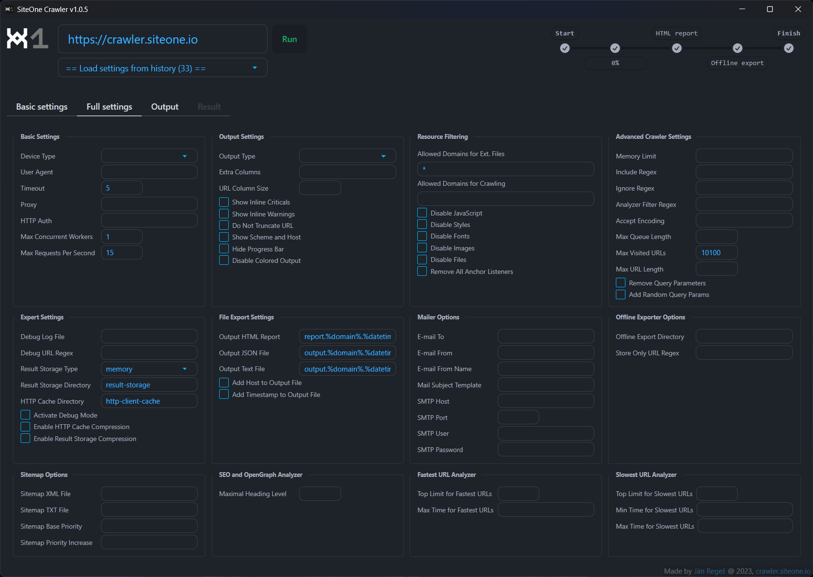

# SiteOne Crawler GUI (desktop application)

This is a desktop application to very useful command-line tool [SiteOne Crawler](https://github.com/janreges/siteone-crawler) (watch [video](https://www.youtube.com/watch?v=25T_yx13naA&list=PL9mElgTe-s1Csfg0jXWmDS0MHFN7Cpjwp&index=2)) and is ready for all major platforms - **Windows (x64)**, **macOS (x64, arm64)** and **Linux (x64, arm64)**.

The goal of this desktop application is to **enable comfortable use** of SiteOne Crawler even for users without the need to work with the command line.

More info: https://crawler.siteone.io/

## Screenshots and video

Animated GIF of the application in action - click to Play on the right when autoplay did not start or watch the [commented video](https://www.youtube.com/watch?v=rFW8LNEVNdw&list=PL9mElgTe-s1Csfg0jXWmDS0MHFN7Cpjwp&index=1).



Screenshot of the form with full settings. The Basic form contains only the basic settings, and the modifications in it are written in the background to this full form. Here you can also set parameters outside the ranges offered in the basic form.



### HTML report video

Watch the [video](https://youtu.be/PHIFSOmk0gk) that describes the HTML report - one of the main outputs of SiteOne Crawler.

[](https://youtu.be/PHIFSOmk0gk)

## Step 1 - Installation

1. **Go** to the [releases](https://github.com/janreges/siteone-crawler-gui/releases) section.
2. **Download** the latest ready version of the installer for your platform (Windows, macOS, Linux) and architecture (x64, arm64).
3. **Install** the application.

## Step 2 - Usage
1. **Run** the installed application - you can find it in your system under the name `SiteOne Crawler`.
2. **Enter** the URL of your website.
3. **Set** optional options. Regular users will be fine with the basic configuration form. Advanced users can also use the form for full settings, **without limiting the values**. The content of these 2 forms is synchronized so **you can use them both**.
4. **Start** crawling.
5. **Wait** for the crawling to finish.
6. On the `Result` tab, you can **open** a detailed **HTML report** or download the report as **JSON** or **TXT**. If you have set, you can view the **generated offline version** of your website or download the **sitemap** xml/txt files.
7. All generated content (reports, offline websites, cache, etc.) is **stored in the folder `SiteOne-Crawler`** on your desktop.
8. **Take a look** at the website [crawler.siteone.io](https://crawler.siteone.io/?utm_source=github-gui-readme) and study [all the possibilities of use](https://crawler.siteone.io/introduction/key-features/#list-of-features).
9. **Enjoy the tool** and [send us feedback](https://crawler.siteone.io/introduction/contact-and-community/) if you have suggestions for improvement.


## For Developers

### Important note

This app was written over several evenings with an **emphasis on useful functionality** and **ease of use**. Both the functionality and the graphical interface were developed continuously.

The structure of the **code is not optimal** and the components are not ideally distributed. Sharing state between components is also not optimal.

In the next versions, **refactoring** will take place with the aim of better dividing the responsibilities of individual components.

If anyone is interested in **helping with the development**, please open an issue on GitHub. However, I would like to implement other functionalities only after the mentioned refactoring.

### Tech Stack

- [Electron](https://www.electronjs.org/) as a desktop app framework
- [Svelte](https://svelte.dev/) as a JS framework
- [TypeScript](https://www.typescriptlang.org/) for type checking
- [Vite](https://vitejs.dev/) as a bundler
- [daisyUI](https://kit.svelte.dev/) and [Tailwind CSS](https://tailwindcss.com/) for UI
- [SiteOne Crawler](https://github.com/janreges/siteone-crawler) as a command-line tool for crawling, generating reports or offline versions of websites

### Installation

```bash
# checkout repository
git checkout https://github.com/janreges/siteone-crawler-gui.git
cd siteone-crawler-gui

# initialize and download submodule with command-line SiteOne Crawler into src/siteone-crawler
git submodule update --init --recursive

# install dependencies
npm install
```

### Development

```bash
# run development server - it will open an Electron app with hot-reloading
$ npm run dev
```

### Build

**Note**: In the first version, I did not emphasize the treatment of all problems reported by svelte-check. Therefore, to create a build, it is necessary to remove `npm run typecheck &&` from `build` script in `package.json`. If anyone wants to participate in the development of this GUI application, I will be happy for help and pull requests.

```bash
# NOTICE: builds have to be run on the target platform

# For Windows (x64)
$ npm run build:win-x64

# For macOS (x64)
$ npm run build:mac-x64

# For macOS (arm64)
$ npm run build:mac-arm64

# For Linux (x64)
$ npm run build:linux-x64

# For Linux (arm64)
$ npm run build:linux-arm64
```

## License

This work is licensed under a [](https://opensource.org/licenses/MIT)

